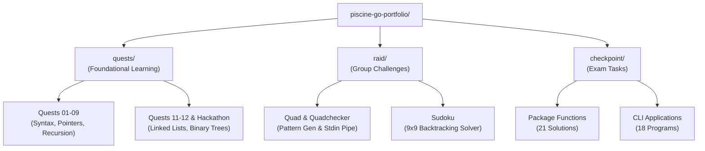

# 01Edu Go Piscine: Learning and Exam Portfolio


Repository containing the full codebase, algorithm exercises, collaborative projects, and official exam solutions completed during the 01Edu Go Piscine program at Learn2Earn NG.

## Table of Contents
- [Program Context and Constraints](#program-context-and-constraints)
- [Repository Architecture](#repository-architecture)
- [Pillar Breakdown](#pillar-breakdown)
  - [1. Foundational Quests](#1-foundational-quests-quests)
  - [2. Algorithmic Raids](#2-algorithmic-raids-raid)
  - [3. Checkpoint Exams](#3-checkpoint-exams-checkpoint)
- [Technical Skills Matrix](#technical-skills-matrix)
- [Execution and Testing](#execution-and-testing)
- [License and Author](#license-and-author)

## Program Context and Constraints
The 01Edu Go Piscine is an intensive programming boot camp focused on low-level language mechanics, algorithm design, and system constraints. All implementations adhere to strict requirements:

- Restricted Standard Library Usage: Solutions rely on core Go primitives (`unsafe`, `os`, `fmt`, `strconv`) without external third-party dependencies.
- Pointer Operations and Memory Management: Explicit pointer arithmetic, slice header manipulation, and memory layout inspection.
- Algorithmic Rigor: Time and space complexity optimizations for recursive backtracking, string parsing, and data structures.

## Repository Architecture



## Pillar Breakdown

### 1. Foundational Quests (`quests/`)
Core progressive learning modules covering Go fundamentals from basic syntax to advanced pointer-based data structures:

- [`quest01`](./quests/quest01): Shell commands, environment setup, and repository creation.
- [`quest02`](./quests/quest02): Functions, character printing using low-level routines, and integer output.
- [`quest03`](./quests/quest03): Pointers, basic arithmetic operations, string reversal, and `atoi` conversions.
- [`quest04`](./quests/quest04): Recursion, factorials, Fibonacci sequences, power calculations, and square roots.
- [`quest05`](./quests/quest05): String indexing, slice manipulation, character transformations, and `trimatoi`.
- [`quest06`](./quests/quest06): CLI argument parsing, parameter sorting, and program flag handling.
- [`quest07`](./quests/quest07): Memory allocation, append operations, slice ranges, and custom string splitting.
- [`quest08`](./quests/quest08): Struct definitions, custom types, memory alignment, and Unix utility clones (`cat`, `ztail`).
- [`quest09`](./quests/quest09): Function pointers, map/filter higher-order routines, and `doop` arithmetic parser.
- [`quest11`](./quests/quest11): Singly linked list implementations including node insertion, deletion, reversing, and sorting.
- [`quest12`](./quests/quest12): Binary search tree structures, node insertions, level traversals, and tree balance checking.
- [`Hackathon`](./quests/Hackathon): Timed intensive coding marathon exercises.

### 2. Algorithmic Raids (`raid/`)
Complex collaborative projects requiring system design, CLI pipeline integration, and search optimization:

- [`quad`](./raid/quad): ASCII pattern generator producing 5 geometric box variants (`quadA` through `quadE`) based on width and height parameters.
- [`quadchecker`](./raid/quadchecker): Pattern identification tool that reads standard input from a pipe to reverse-engineer matching quad generators and dimensions.
- [`sudoku`](./raid/sudoku): High-performance 9x9 Sudoku solver utilizing recursive backtracking algorithm to validate board constraints and print solutions.

### 3. Checkpoint Exams (`checkpoint/`)
All 39 official exam tasks are 100% completed, tested, and passing:

- Package Functions (21 exercises): Algorithmic helper functions implemented in isolated packages (`canjump`, `chunk`, `concatalternate`, `concatslice`, `fifthandskip`, `findprevprime`, `fromto`, `iscapitalized`, `itoa`, `itoabase`, `notdecimal`, `printmemory`, `retainfirsthalf`, `revconcatalternate`, `saveandmiss`, `slice`, `thirdtimeisacharm`, `weareunique`, `wordflip`, `zipstring`).
- CLI Applications (18 exercises): Standalone command-line utilities parsing `os.Args` and producing formatted stdout (`addprimesum`, `brackets`, `brainfuck`, `findpairs`, `fprime`, `grouping`, `hiddenp`, `inter`, `options`, `piglatin`, `printrevcomb`, `reversestrcap`, `revwstr`, `romannumbers`, `rostring`, `rpncalc`, `union`, `wdmatch`).

## Technical Skills Matrix

| Category | Key Concepts Covered | Primary Directory | Example Implementations |
| :--- | :--- | :--- | :--- |
| **Algorithms** | Backtracking, Prime Factorization, Stack Evaluation | `raid/`, `checkpoint/` | `sudoku`, `fprime`, `rpncalc`, `brackets` |
| **Data Structures** | Linked Lists, Binary Trees, Slices, Maps | `quests/` | `quest11`, `quest12`, `chunk`, `findpairs` |
| **Low-Level & Memory** | Pointer Arithmetic, Hex Dumps, Bitwise Flags | `quests/`, `checkpoint/` | `quest03`, `printmemory`, `options` |
| **System & I/O** | Stdin Pipelines, CLI Flags, Esolang Interpreters | `raid/`, `checkpoint/` | `quadchecker`, `brainfuck`, `doop` |

## Execution and Testing

### Environment Requirements
- Linux environment (Ubuntu / WSL2 recommended)
- Go 1.21 or higher installed

### 1. Running Quest Exercises
Navigate to any quest folder and run via Go:

```bash
# Example: Run Quest 08 cat clone
cd quests/quest08/cat
go run main.go sample.txt
```

### 2. Running Raid Projects
Build and execute Raid applications:

```bash
# Example: Run Sudoku solver
cd raid/sudoku
go run . ".96.4...11...6...45...7.8...4...1.9.0.7...6.2.8...4...1...2...93...1.47."

# Example: Test Quad pattern with Quadchecker pipeline
cd raid/quad
go build -o quadA quads/quadA.go main.go
cd ../quadchecker
go build -o quadchecker main.go
../quad/quadA 5 3 | ./quadchecker
```

### 3. Running Checkpoint Tasks
Execute standalone CLI applications or test packages:

```bash
# Example: Run RPN Calculator
cd checkpoint/rpncalc
go run . "1 2 * 3 * 4 +"

# Example: Run package test suite
cd checkpoint/canjump
go test -v ./...
```

## License and Author

Author: Jezreal Momoh ([`jmomoh`](https://github.com/jezreal-dev))  
Repository: [github.com/jezreal-dev/piscine-go-portfolio](https://github.com/jezreal-dev/piscine-go-portfolio)  
License: Distributed under the [MIT License](./LICENSE).
